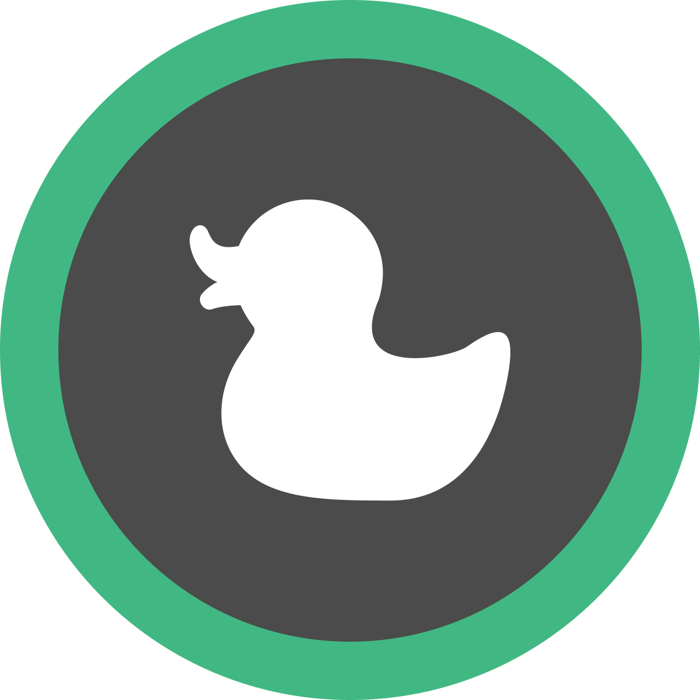

<div align="center">
  
</div>

# markduck

[](https://www.npmjs.com/package/markduckjs)
[](https://david-dm.org/ymmooot/markduckjs)
[](https://codecov.io/gh/ymmooot/markduck)
[](https://github.com/prettier/prettier)
[](https://www.typescriptlang.org/docs/home.html)

Render markdown with your [Vue](https://github.com/vuejs/vue) components.

## Installation

```
$ npm install markduckjs
or
$ yarn add markduckjs
```

## Usage

```vue
<template>
  <markduck :markdown="markdown"/>
</template>

<script>
import UnorderedList from '/your/custom/components/UnorderedList.vue';
import ListItem from '/your/custom/components/ListItem.vue';
import FigureImage from '/your/custom/components/FigureImage.vue';

import gemojiToEmoji from 'remark-gemoji-to-emoji';
import rehypePrism from '@mapbox/rehype-prism';
import 'prismjs/themes/prism.css';

export default {
  data() {
    return {
      markdown: '# your markdown :duck:',
    };
  },
  components: {
    markduck: (() => {
      return Markduck({
        remarkPlugins: [gemojiToEmoji],
        rehypePlugins: [rehypePrism],
        components: {
          ul: UnorderedList,
          li: ListItem,
          img: nodeData => {
            if (nodeData.attrs.alt) {
              return FigureImage;
            }
            return undefined;
          },
        },
      });
    })(),
  },
};
```

## Options

### components

Register Vue components corresponding to each HTML element.

#### type

`Object`

```ts
type ComponentRegisterFunc = (data: VNodeData) => VueConstructor<Vue> | undefined;

type ComponentRegisterOption = {
  [keyof: string]: VueConstructor<Vue> | ComponentRegisterFunc;
};
```

#### default

`{}`

### remarkPlugins

[Remark](https://github.com/remarkjs/remark) plugins.  
A part of lists is here 👉 [github.com/remarkjs/remark/blob/master/doc/plugins.md#list-of-plugins](https://github.com/remarkjs/remark/blob/d1d4fe6bf4fb7888e4b5423444fa266a424bdbac/doc/plugins.md#list-of-plugins)

#### type

`Array` of `Plugin` or `[Plugin, Settings]`
(`Plugin` and `Settings` are from [Unified](https://github.com/unifiedjs/unified).)

#### default

`[]`

### rehypePlugins

Same as remarkPlugins.  
Rehype plugins will run after remarkPlugins.

### sanitizeScheme

## Demo

Clone and run:

```bash
npm run demo
```

## Flow of conversion from markdown to Vue

```
            remark-parser       remark-rehype      createElement
your markdown      ->      mdast      ->      hast      ->      vue
                            ↑                  ↑
                  your remark plugin     your rehype plugin
```
